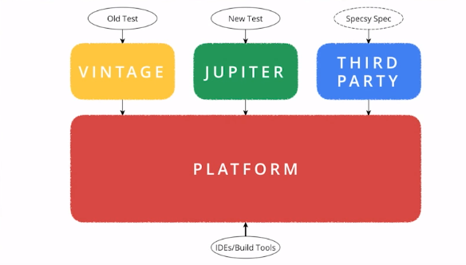

# junit5-Examples

JUnit 5 = JUnit Platform + JUnit Jupiter + JUnit Vintage

####Whats New:
- Display name 
    - @DisplayName 
- Disable test
    - @Disabled
- LifecycleTests
    - @BeforeAll
    - @BeforeEach
    - @AfterEach
    - @AfterAll
- ParameterisedTests 
- TaggedTests
- Exception Testing
- Operating System Conditions
    - @EnabledOnOS/ @DisabledOnOs
- JRE Condition
    - @EnabledOnJre/ @DisaledOnJre  
- NestedTests       

####How to Run Project:
 - clone the project and perform mvn clean install
 - Run all the test examples under test folder

####References:
1. https://junit.org/junit5/

